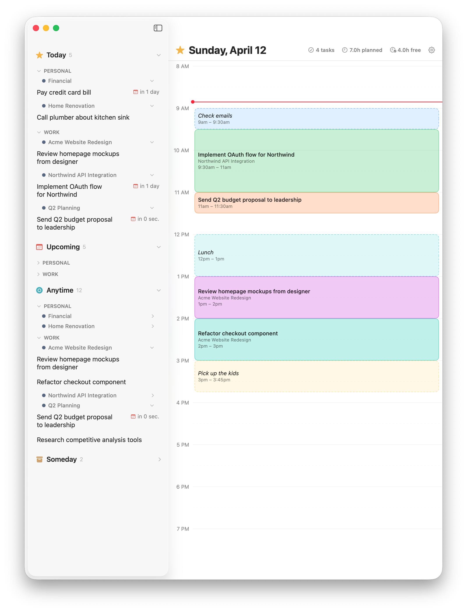

<div align="center">

# Slotted

**A native macOS time-blocking companion for [Things 3](https://culturedcode.com/things/).**

[](LICENSE)
[](https://www.apple.com/macos/)
[](https://swift.org)

</div>

Things 3 is great for managing tasks but doesn't have a way to plan your day on a timeline. Slotted reads your Things 3 tasks and lets you drag them onto a visual schedule grid — turning your task list into a real day plan.



> [!NOTE]
> **Personal side project, used daily by the author.** No prebuilt release yet — build from source (see [Getting Started](#getting-started)). Issues and PRs are welcome; see [Contributing](#contributing).

## Contents

- [Why Slotted](#why-slotted)
- [Features](#features)
- [Your Things 3 Data is Safe](#your-things-3-data-is-safe)
- [Getting Started](#getting-started)
- [Tech Stack](#tech-stack)
- [Architecture](#architecture)
- [Contributing](#contributing)
- [License](#license)
- [Acknowledgements](#acknowledgements)

## Why Slotted

Time blocking turns intentions into commitments. Instead of a flat list of "things I might do today," you decide *when* you'll do each one and *how long* it will take. Slotted brings that practice to Things 3 without changing how you already use it.

- **Read-only** — Slotted never modifies your Things 3 data
- **Live updates** — changes in Things 3 appear instantly via file-system monitoring
- **Native** — built with SwiftUI for macOS, not a web wrapper
- **Private** — your data stays on your devices (with optional iCloud sync between your own Macs)
- **No telemetry** — Slotted makes no network calls except to your own iCloud account when sync is enabled

## Features

### Task List (left panel)

- Live read-only access to your Things 3 database
- Tasks grouped by Things 3 categories: Inbox, Today, Upcoming, Anytime, Someday
- Area → Project hierarchy with expand/collapse controls
- Areas and projects sorted alphabetically; tasks within a project keep your Things 3 order
- Deadline indicators with red calendar icon
- Completed tasks automatically removed from the schedule
- Option to hide or keep tasks visible after scheduling

### Schedule Grid (right panel)

- **Drag tasks** from the list onto the timeline
- **Single-gesture interaction** — drag from the top edge to resize the start, the bottom edge to resize the end, or the middle to move the block
- **Smooth drag** with snap-to-grid on release (15-minute increments)
- **Standalone time blocks** for things that aren't tasks — double-click an empty slot to create a block for "Lunch", "Morning run", etc.
- **Custom block colors** — click the color dot on hover to cycle through 12 soft pastel colors
- **Multi-timebox** — schedule the same task in multiple time slots (e.g., before and after lunch)
- **Keyboard shortcuts** — click a block to select it; arrow keys nudge it by 15 minutes, Delete removes it
- **Drop target highlight** when dragging from the task list
- **Now line** showing the current time
- **Carry forward** — turn off "Clear schedule at midnight" in Settings and blocks persist into the next day, so recurring routines (lunch, breaks) don't need to be recreated

### Calendar Integration

- Import events from macOS calendars and display them on the schedule
- Calendar events use a distinct hatched pattern so they're easy to distinguish from task blocks
- Read-only — calendar events block out time but can't be moved or resized
- Auto-refreshes when calendar changes
- Toggle on/off in Settings

### iCloud Sync

- Sync schedule data across your devices via CloudKit
- Uses CKSyncEngine for reliable, offline-capable sync with conflict resolution
- Persisted server record cache for clean restarts
- Simple toggle — no account setup needed beyond being signed into iCloud

### Settings

- Schedule hours (start/end)
- Text size slider
- Light / Dark / Auto appearance
- Hide empty categories
- Hide empty projects
- Hide scheduled tasks (toggle off for multi-timebox)
- Show / hide deadlines
- Show / hide current time line
- Show calendar events
- Clear schedule at midnight (when off, blocks carry forward to the next day)
- iCloud Sync on/off

## Your Things 3 Data is Safe

Slotted uses **read-only access** to your Things 3 database. It cannot modify, delete, or corrupt your data.

- The database connection is opened with SQLite's `SQLITE_OPEN_READONLY` flag — write attempts are rejected at the database engine level
- There are no write statements (`INSERT`, `UPDATE`, `DELETE`) against the Things 3 database anywhere in the codebase
- Your schedule is stored in a completely separate database
- File monitoring uses macOS kernel events to detect changes — it does not open or modify any Things 3 files

## Getting Started

### Requirements

- macOS 26 (Tahoe) or later
- Xcode 16.3 or later
- [Things 3](https://culturedcode.com/things/)
- [XcodeGen](https://github.com/yonaskolb/XcodeGen) (for project generation)

### Build from source

```bash
# 1. Clone the repository
git clone https://github.com/LeonardHope/Slotted-Timeblocking-for-Things-3.git
cd Slotted-Timeblocking-for-Things-3

# 2. Install XcodeGen if you don't have it
brew install xcodegen

# 3. Generate the Xcode project
xcodegen generate

# 4. Open in Xcode
open TimeboxForThings3.xcodeproj
```

In Xcode, select the `TimeboxForThings3` scheme and set your own Development Team under **Signing & Capabilities** before building. (Alternatively, add `DEVELOPMENT_TEAM: YOURTEAMID` to `project.yml` and re-run `xcodegen generate`.) For iCloud sync, your Apple Developer account also needs CloudKit configured.

To build from the command line:

```bash
xcodebuild -project TimeboxForThings3.xcodeproj -scheme TimeboxForThings3 -destination 'platform=macOS' build
```

### First run

On launch, Slotted asks you to point it at your Things 3 group container so it can read your tasks (this is required by the macOS App Sandbox). The folder lives at:

```
~/Library/Group Containers/JLMPQHK86H.com.culturedcode.ThingsMac
```

Slotted stores the access grant as a security-scoped bookmark and never modifies any file inside that folder.

### Demo mode

For screenshots and previews, set the `SLOTTED_DEMO=1` environment variable in the Xcode scheme. Slotted will load with curated demo data instead of reading your real Things 3 database, and writes the demo schedule to a separate file so your real schedule is untouched.

## Tech Stack

- **SwiftUI** with `NavigationSplitView`
- **[GRDB.swift](https://github.com/groue/GRDB.swift)** for local SQLite storage
- **CloudKit** + `CKSyncEngine` for iCloud sync
- **EventKit** for calendar integration
- **[XcodeGen](https://github.com/yonaskolb/XcodeGen)** for project generation
- **macOS 26** (Tahoe) target
- **Swift 6** with strict concurrency

## Architecture

- **Things 3 data** — read-only access to `~/Library/Group Containers/JLMPQHK86H.com.culturedcode.ThingsMac/` with live WAL-file monitoring for real-time updates. Area is inherited from project via a `COALESCE` query.
- **Schedule data** — separate SQLite database at `~/Library/Application Support/TimeboxForThings3/schedule.sqlite`
- **Calendar data** — EventKit with `EKEventStoreChanged` observation for live updates
- **Task source abstraction** — tasks are read through a `TaskProvider` protocol, kept separate from the UI layer
- **App Sandbox enabled** — Things 3 database access uses security-scoped bookmarks granted by the user via `NSOpenPanel`. No private entitlements required.

## Contributing

Issues and pull requests are welcome.

- **Found a bug?** [Open an issue](https://github.com/LeonardHope/Slotted-Timeblocking-for-Things-3/issues/new) with reproduction steps and your macOS and Things 3 versions.
- **Have a feature idea?** Open an issue first to discuss — Slotted aims to stay minimal, so not every request will be a good fit.
- **Sending a PR?**
  - Run `xcodegen generate` so committed project files stay consistent with `project.yml`.
  - Confirm `xcodebuild -project TimeboxForThings3.xcodeproj -scheme TimeboxForThings3 -destination 'platform=macOS' build` succeeds.
  - Match the existing code style (SwiftUI idioms, Swift 6 strict concurrency).
  - Keep PRs focused on a single change.

## License

Slotted is released under the [MIT License](LICENSE).

## Acknowledgements

- [Things 3](https://culturedcode.com/things/) by Cultured Code — the task manager Slotted is built around, and the design inspiration.
- [GRDB.swift](https://github.com/groue/GRDB.swift) by Gwendal Roué — Swift SQLite toolkit used for both Things 3 reads and Slotted's own schedule store.
- [XcodeGen](https://github.com/yonaskolb/XcodeGen) — keeps the Xcode project reproducible from `project.yml`.

---

Slotted is an independent project and is not affiliated with, endorsed by, or sponsored by Cultured Code. Things® is a trademark of Cultured Code GmbH & Co. KG.
